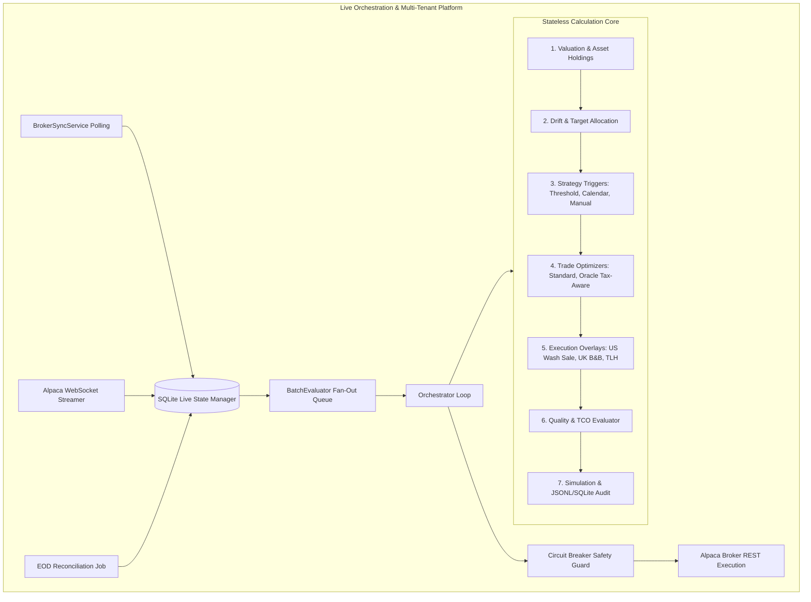
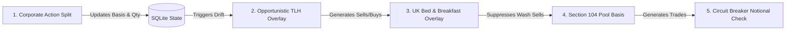

# Documentation-Driven Test Suite Audit

## TL;DR

- **Is the test suite conceptually sound?**  
  **Yes, in the deterministic mathematical core.** The core calculation engine (valuation, drift, threshold/calendar/manual triggers, boundary sizing, tax-lot FIFO/LIFO/Section 104 allocation, and corporate actions basis math) is deterministic, precision-conscious (`decimal.js`), and well-structured.
- **Does it test the important documented behavior?**  
  **Partially.** The test suite covers single-account mathematical formulas and happy paths very well. However, as the project evolved into an asynchronous, multi-tenant B2B SaaS platform (ADRs 0041–0061), several live services and background orchestrators were added with either **zero test coverage** (e.g., `BrokerSyncService` [ADR-0055](../decisions/0055-continuous-broker-state-sync.md)), **mocked-out dead paths** (e.g., file log rotation [ADR-0046](../decisions/0046-use-size-based-rotation-and-simulation-reset.md)), or **untested multi-tenant isolation boundaries**.
- **What are the biggest gaps?**  
  1. `BrokerSyncService` ([ADR-0055](../decisions/0055-continuous-broker-state-sync.md)) has **0 tests** for background price/order/position polling and state synchronization.  
  2. `FileAuditStorage` log rotation ([ADR-0046](../decisions/0046-use-size-based-rotation-and-simulation-reset.md)) is completely masked by a mock in `tests/storage.test.ts` that always throws `ENOENT`.  
  3. `SqliteAuditStorage` has no dedicated tests.  
  4. Silent cash clamping in `src/core/simulation.ts` violates [ADR-0006](../decisions/0006-reject-negative-cash-in-trade-proposal-generation.md) and Repository Rule 7 (Data and Domain Integrity) by silently zeroing negative cash between -$1.00 and $0.00 instead of rejecting invalid states.  
  5. Active open handle leaks in asynchronous tests cause worker processes to fail graceful shutdown (`Jest` teardown warning).
- **Are any existing tests questionable or misleading?**  
  Yes. `tests/storage.test.ts` gives the illusion of testing audit storage while bypassing rotation logic; `tests/eod-reconciliation.test.ts` mocks the Alpaca adapter completely and does not test database transaction rollback on network failure; and `tests/simulation.test.ts` logs debug output (`Debug cash: postTradeCash=0, estimated=1`) to stdout during normal test runs.
- **How confident should we be in the current suite?**  
  **Moderate (6.5/10).** High confidence in the core mathematical formulas; low-to-medium confidence in multi-tenant background concurrency, real-time broker synchronization, log rotation persistence, and asynchronous error recovery.

---

## 1. Executive Summary

| Dimension | Rating | Description |
| :--- | :--- | :--- |
| **Overall Quality** | **Reasonable** | 306 tests across 43 suites pass with fast in-memory execution, but depth varies dramatically between the math core and background services. |
| **Documentation Alignment** | **Strong** | High adherence to ADRs 0001–0040 and 0058–0061; traceability across frontmatter, PRDs, and domain types is exemplary. |
| **Strongest Areas** | **Excellent** | Core deterministic valuation (`valuation.ts`), tax-lot matching (FIFO, LIFO, Section 104 in `trades.ts` & `uk-tax.ts`), corporate actions basis invariance (`corporate-actions.ts`), and boundary trade sizing. |
| **Weakest Areas** | **Weak** | Live broker state synchronization (`sync.ts`), audit log rotation (`storage.ts`), asynchronous timer cleanup, deposit allocation modes (`CURRENT_WEIGHT`, `FIXED_TARGET`), and cross-tenant data isolation under concurrent writes. |
| **Primary Risks** | **High** | 1. Production drift desync from untested broker polling loop.<br>2. Disk exhaustion from untested log rotation.<br>3. Silent financial calculation errors from cash clamping in simulation. |

**Overall Qualitative Rating: Reasonable**  
The engine's computational core is solid, well-typed, and mathematically verified. However, the operational shell (background sync, storage rotation, multi-tenant concurrency) lacks the rigorous verification applied to the calculation core.

---

## 2. Scope & Methodology

### Documentation Reviewed
- **Architecture & Vision**: `docs/architecture/engine-architecture.md`, `live-agent-vision.md`, `overview.md`, `personas.md`.
- **PRDs**: `docs/prd/execution-overlays-tlh-prd.md`, `scheduled-recurring-cash-flow-prd.md`, `rebalancing-engine-tax-lots-prd.md`, `rebalancing-engine-deferred-capabilities-prd.md`, `original-vision-prd.md`.
- **ADRs**: ADR-0001 through ADR-0061 in `docs/decisions/`.
- **Research & Audits**: `docs/strategy-traceability/full-chain-rebalancing-strategy-review.md`, `docs/audits/test-case-audit.md`, `docs/audits/final-mvp-audit.md`, `docs/audits/red-team-audit-current.md`.

### Tests Reviewed
- 43 test suites comprising 306 individual tests located in `tests/`, `tests/core/`, and `tests/strategy/`.

### Audit Methodology
1. **Behavioral Extraction**: Mapped explicit requirements, mathematical invariants, state transitions, and constraints from documentation.
2. **Traceability Analysis**: Mapped each documented requirement to corresponding test assertions.
3. **Adversarial Evaluation**: Evaluated whether realistic implementation bugs (e.g. inverted signs, dropped transactions, race conditions, negative cash, unhandled WebSocket reconnections) could pass the test suite.

---

## 3. Documentation & Intended Behavior Map



---

## 4. Requirements-to-Test Traceability Matrix

| Area | Requirement / Behavior | Documentation Source | Existing Tests | Coverage Assessment | Risk | Notes |
| :--- | :--- | :--- | :--- | :--- | :--- | :--- |
| **Deterministic Valuation** | Market value calculation with `decimal.js`, zero prices, missing prices, asset sum | ADR-0023, `engine-architecture.md` | `tests/valuation.test.ts`, `tests/numeric.test.ts` | **Strong** | Low | Decimal arithmetic and missing price errors thoroughly tested. |
| **Cash Invariants & Deficits** | Reject negative cash balance; fund settled withdrawal deficits via sales | ADR-0006, ADR-0031 | `tests/trades.test.ts` (L170-226) | **Adequate** | Medium | Proposal generation rejects negative cash, but simulation silently clamps small negative cash. |
| **Deposit Allocation Modes** | Support `REBALANCING`, `CURRENT_WEIGHT`, and `FIXED_TARGET` cash deployment | `src/models/domain.ts` (L151), ADR-0026 | `tests/trades.test.ts` (L71-91) | **Partial** | Medium | Only `REBALANCING` mode is actively tested; `CURRENT_WEIGHT` and `FIXED_TARGET` are not explicitly exercised. |
| **Boundary Target Sizing** | Trade only to tolerance band boundary (absolute & relative modes) | ADR-0018, ADR-0024 | `tests/trades.test.ts` (L292-389), `tests/simulation.test.ts` (L161-215) | **Strong** | Low | Absolute and relative boundary calculations, zero-target rejections, and residual drift verified. |
| **Tax-Lot Allocation Modes** | FIFO, LIFO, HIGHEST_COST, LOWEST_COST, SECTION_104 | ADR-0058, ADR-0059 | `tests/trades.test.ts` (L390-539), `tests/uk-tax.test.ts` | **Strong** | Low | All 5 modes tested including unit cost error conditions. |
| **Tax-Loss Harvesting (TLH)** | Opportunistic TLH with asset substitution groups and drift aggregation | ADR-0042, `execution-overlays-tlh-prd.md` | `tests/overlays.test.ts` | **Strong** | Low | Identification of loss thresholds, substitute buys, and missing substitute failure modes covered. |
| **US Wash-Sale Lockout** | Suppress intra-day wash sales; prioritize drift buys over TLH sells | ADR-0042, `execution-overlays-tlh-prd.md` | `tests/overlays.test.ts` (L129-198) | **Strong** | Low | Intra-proposal wash sale detection and priority rules tested. |
| **UK Bed & Breakfast & Pool** | HMRC same-day matching, 30-day repurchase window, Section 104 pooling | ADR-0059 | `tests/uk-tax.test.ts` | **Strong** | Low | 30-day date boundaries (0, 14, 30, 31 days) and pooled unit costs verified. |
| **Corporate Actions** | Stock splits (fwd/rev), cash dividends, mergers; basis invariance $Q \times C$ | ADR-0060 | `tests/core/corporate-actions-processor.test.ts` | **Strong** | Low | Split basis preservation, dividend crediting, and atomic SQLite update covered. |
| **Fan-Out Queue Worker** | Throttled batch evaluation, rate limiting, error isolation, telemetry | ADR-0061 | `tests/core/batch-evaluator.test.ts` | **Adequate** | Medium | Batch chunking and event emission tested; concurrent worker contention not tested. |
| **Continuous Broker Sync** | Polling Alpaca for prices, orders, cash, and holdings across tenants | ADR-0055 | **None** | **Missing** | **High** | `BrokerSyncService` has zero direct unit or integration tests. |
| **Audit Log Rotation** | 5MB size threshold, `.1`/`.2`/`.3` rotation, max 3 files | ADR-0046 | `tests/storage.test.ts` | **Weak** | **High** | Test mocks `fs.stat` to always return `ENOENT`, never executing rotation code. |
| **SQLite Audit Trail** | Insert/replace audit records into `AuditTrails` table | ADR-0039, ADR-0049 | None in `storage.test.ts` | **Partial** | Medium | Implicitly touched by orchestrator, but lacks dedicated unit tests. |
| **Circuit Breakers** | Max trades per session, gross notional limits, unconfigured broker errors | `live-agent-vision.md`, `engine-architecture.md` | `tests/circuit-breaker.test.ts`, `tests/orchestrator.test.ts` | **Adequate** | Medium | Notional limits and session count limits covered. |
| **Market Calendar / Hours** | Market open/close, weekend detection, half-days, holiday scheduling | `src/services/market-calendar.ts` | `tests/market-calendar.test.ts` | **Adequate** | Low | Schedule intervals, trading day checks, and holiday evaluations tested. |
| **REST API & RBAC** | Multi-tenant auth, role separation (Admin, Advisor, Ops), OpenAPI docs | ADR-0052, `personas.md` | `tests/api.test.ts` | **Adequate** | Medium | JWT auth, tenant boundary filtering, and OpenAPI specs covered. |

---

## 5. Existing Test Suite Assessment

### Core Calculation Engine (`valuation`, `drift`, `trades`, `numeric`, `uk-tax`)
- **What is tested:** Deterministic portfolio valuation, decimal rounding policy, weight computations, absolute and relative drift, threshold and calendar triggers, manual triggers, boundary target sizing, minimum trade size suppression, lot allocation strategies (FIFO, LIFO, HIGHEST_COST, LOWEST_COST, SECTION_104), and UK 30-day B&B matching.
- **Strong points:** Very thorough boundary tests, explicit epsilon checks, and clear test separation.
- **Problematic assumptions / weaknesses:**
  - In `src/core/simulation.ts` (L95-97), any negative cash between -$1.00 and $0.00 is silently reset to zero:
    ```typescript
    if (postTradeCash.lt(0)) {
      postTradeCash = toDecimal(0);
    }
    ```
    This hides small trade-sizing discrepancies and violates ADR-0006.
  - Deposit allocation modes (`CURRENT_WEIGHT`, `FIXED_TARGET`) documented in `src/models/domain.ts` have no corresponding tests in `tests/trades.test.ts`.

### Overlays & Optimization (`overlays`, `quality`, `optimizer`, `oracle-adapter`, `trade-optimizer`)
- **What is tested:** Generative opportunistic TLH trade injection, Wash-Sale suppression, UK Bed & Breakfast lockout, Projected Gradient Descent solver convergence, and Oracle adapter circuit breaking.
- **Strong points:** Excellent failure mode testing for missing substitutes, unpriceable assets, and concentration limit breaches.
- **Weaknesses:**
  - Multi-asset circular substitution groups (e.g. A -> B -> C -> A) are not tested.
  - In `tests/optimizer.test.ts` (L57-66), numerical instability testing relies on mocking `Math.max = jest.fn().mockReturnValue(NaN)` rather than passing actual degenerate or non-positive-definite covariance matrices.

### Live Orchestration, Broker & Storage (`orchestrator`, `alpaca-broker`, `alpaca-streamer`, `storage`, `sqlite-state`, `batch-evaluator`)
- **What is tested:** SQLite database schema cascades, model update fan-out, queue consumption, Alpaca REST translation, and WebSocket authentication.
- **Weaknesses & Gaps:**
  - **`BrokerSyncService` (`src/broker/sync.ts`) has 0 dedicated tests.**
  - **`FileAuditStorage` rotation (`tests/storage.test.ts`) is mocked with a rejected promise (`ENOENT`), meaning log rotation logic is never executed.**
  - **Open handles leak after test run:** Jest warns that a worker process failed to exit gracefully due to un-cleared timers or active sockets.

---

## 6. Critical & High-Priority Findings

### Finding TEST-AUDIT-001
**Severity:** High  
**Confidence:** High  
**Area:** Core Simulation / Financial Integrity  
**Documentation:** ADR-0006 (Reject negative cash in trade proposal generation), Repository Rule 7 (Data and Domain Integrity)  
**Existing tests:** `tests/simulation.test.ts`

#### Finding
`src/core/simulation.ts` (L86-97) allows up to $0.01 or 1% relative error in cash reconciliation, and then explicitly clamps small negative cash values to zero without throwing:
```typescript
if (postTradeCash.lt(-1)) {
  throw new Error('Post-trade simulation produced negative cash');
}
if (postTradeCash.lt(0)) {
  postTradeCash = toDecimal(0);
}
```

#### Why it matters
Financial calculations must not silently swallow negative cash. If a rounding error or oversizing bug generates a post-trade cash deficit of -$0.50, the simulator silently wipes the deficit and reports $0.00 cash, hiding trade sizing defects from the audit trail.

#### Evidence
ADR-0006 states: *"This follows the project bias toward explicit validation over silent fallback behavior."*

#### Recommendation
Tighten simulation cash reconciliation to `CALCULATION_EPSILON` (1e-10) or explicit rounding tolerance (`OUTPUT_ROUNDING_POLICY.moneyDecimalPlaces`), and remove the silent zeroing of negative cash values.

#### Suggested test cases
1. Assert that `simulatePostTrade` throws `Post-trade simulation produced negative cash` when post-trade cash is `-0.01` or `-0.50`.
2. Assert exact decimal reconciliation between proposal estimated cash and simulated cash.

---

### Finding TEST-AUDIT-002
**Severity:** High  
**Confidence:** High  
**Area:** Live Broker Integration / State Sync  
**Documentation:** ADR-0055 (Continuous Broker State Synchronization)  
**Existing tests:** None  

#### Finding
`BrokerSyncService` (`src/broker/sync.ts`) (which groups portfolios by tenant, polls Alpaca for prices, updates pending orders, syncs positions/cash, and triggers orchestrator ticks) has zero tests in the test suite.

#### Why it matters
If `BrokerSyncService` encounters an unhandled exception during one tenant's sync (e.g., rate limit, network timeout, symbol translation failure), the background sync loop could crash or fail to sync subsequent tenants, freezing rebalancing across the platform.

#### Evidence
Search across `tests/` for `BrokerSyncService` yields 0 results.

#### Recommendation
Create `tests/broker-sync.test.ts` to test:
1. Multi-tenant grouping and batching of prices.
2. Symbol reverse-translation via `getInstrumentId`.
3. Order execution status updates and state synchronization.
4. Error isolation (one failing tenant does not block other tenants).

---

### Finding TEST-AUDIT-003
**Severity:** High  
**Confidence:** High  
**Area:** Audit Storage & Compliance  
**Documentation:** ADR-0046 (Use size-based log rotation)  
**Existing tests:** `tests/storage.test.ts`

#### Finding
In `tests/storage.test.ts` (L15), `fs.promises.stat` is mocked to always reject with `ENOENT`. As a result, the log rotation logic in `src/audit/storage.ts` (L23-45) (`MAX_SIZE = 5MB`, max 3 files, renaming `.1 -> .2`, `.2 -> .3`) is never executed or validated by tests.

#### Why it matters
In high-throughput environments, audit logs could grow indefinitely or crash during file renaming, violating storage constraints and audit compliance.

#### Recommendation
Add unit tests in `tests/storage.test.ts` that:
1. Simulate file size > 5MB and assert renaming from `audit.jsonl` to `audit.jsonl.1`.
2. Test rotation cascading from `.1 -> .2` and `.2 -> .3`.
3. Test pruning/overwriting of files beyond `MAX_FILES`.

---

### Finding TEST-AUDIT-004
**Severity:** High  
**Confidence:** High  
**Area:** Test Suite Infrastructure / Open Handles Leak  
**Documentation:** `package.json`, Repository Rule 9 (Tooling and Automation)  
**Existing tests:** Entire Jest test run  

#### Finding
Running `npm test` outputs:
`A worker process has failed to exit gracefully and has been force exited. This is likely caused by tests leaking due to improper teardown. Try running with --detectOpenHandles to find leaks.`

#### Why it matters
Open handles (unclosed WebSockets, un-cleared `setInterval`/`setTimeout` timers, active SQLite connections) cause non-deterministic test teardowns, resource leaks in CI/CD, and potential port collisions.

#### Recommendation
Audit all service teardowns (`AlpacaBrokerStreamer.disconnect()`, `BatchEvaluationWorker.stop()`, `BrokerSyncService.stop()`, `EodReconciliationJob.stop()`, and Express server listeners) to ensure all timers are `.unref()`'d or cleared in `afterEach`/`afterAll`.

---

## 7. Medium & Low-Priority Findings

### Finding TEST-AUDIT-005
**Severity:** Medium  
**Confidence:** High  
**Area:** Trade Proposal Generation  
**Documentation:** `src/models/domain.ts` (L151), ADR-0026  
**Existing tests:** `tests/trades.test.ts`  
- **Finding:** `DepositAllocationMode` types (`CURRENT_WEIGHT`, `FIXED_TARGET`) are defined in domain models but not tested in trade generation.
- **Why it matters:** Sizing logic for cash deployment under alternate allocation modes is untested against edge cases.
- **Recommendation:** Add dedicated test cases in `tests/trades.test.ts` for each deposit allocation mode.

---

### Finding TEST-AUDIT-006
**Severity:** Medium  
**Confidence:** High  
**Area:** Audit Trail Storage  
**Documentation:** ADR-0049 (Use better-sqlite3 for Persistent State Management)  
**Existing tests:** `tests/storage.test.ts`  
- **Finding:** `SqliteAuditStorage` (`src/audit/storage.ts`) is completely absent from `tests/storage.test.ts`.
- **Why it matters:** SQL schema mapping, event ID parsing, and JSON serialization for SQLite audit records are untested in isolation.
- **Recommendation:** Add test suite exercising `SqliteAuditStorage.saveAuditRecord`.

---

### Finding TEST-AUDIT-007
**Severity:** Low  
**Confidence:** High  
**Area:** Code Hygiene & Test Cleanliness  
**Documentation:** Repository Rule 1 (Repository Stewardship)  
**Existing tests:** `tests/simulation.test.ts`  
- **Finding:** `src/core/simulation.ts:89` contains a leftover `console.log` statement: `Debug cash: postTradeCash=0, estimated=1`, which prints to stdout during every `npm test` run.
- **Why it matters:** Pollutes test runner logs and violates production logging conventions (should use structured Pino logger if needed).
- **Recommendation:** Remove the `console.log` or replace with `logger.debug()`.

---

## 8. Missing Test Scenarios

| Priority | Area | Scenario | Expected Behavior | Risk Addressed | Recommended Test Type | Documentation |
| :--- | :--- | :--- | :--- | :--- | :--- | :--- |
| **P0** | Live Broker Sync | `BrokerSyncService` multi-tenant polling with mixed valid and invalid broker API credentials | Valid tenant syncs successfully; invalid tenant logs structured error; sync loop continues without crashing | Platform-wide sync halt on single tenant failure | Integration | ADR-0055 |
| **P0** | Storage | `FileAuditStorage` size threshold breach (>5MB) with active `.1`, `.2` files present | Files rotate `.1 -> .2`, `.2 -> .3`, current -> `.1`; new entries appended cleanly | Unbounded log file growth and disk exhaustion | Unit | ADR-0046 |
| **P1** | Core Simulation | Post-trade cash simulation produces negative cash balance of -$0.05 | Throws explicit error `Post-trade simulation produced negative cash` rather than silently clamping to 0 | Silent financial calculation defects | Unit | ADR-0006 |
| **P1** | Storage | `SqliteAuditStorage` insertion with composite event IDs and null account IDs | Correctly derives `accountId` and `tenantId`, stores JSON inputs/outputs in `AuditTrails` table | Missing compliance audit records | Unit | ADR-0049 |
| **P1** | Overlays | Multi-asset cyclic equivalency groups (e.g. `[['A', 'B'], ['B', 'C']]`) undergoing simultaneous TLH loss | Resolves unique substitute without infinite loops or duplicate trade injections | Broken trade execution and duplicate orders | Unit | `execution-overlays-tlh-prd.md` |
| **P2** | Dynamic Optimizer | Covariance matrix with non-positive-definite eigenvalues or near-collinear assets | Solver detects non-positive semi-definite matrix and safely falls back to equal weights or standard engine | NaN weight propagation across tenant portfolios | Unit | ADR-0048 |
| **P2** | Deposit Modes | Deposit allocation under `CURRENT_WEIGHT` and `FIXED_TARGET` modes | Accurately allocates incoming cash according to current portfolio weights or fixed target weights | Misallocated deposit flows | Unit | `domain.ts` |
| **P3** | Corporate Actions | Reverse stock split resulting in sub-cent fractional share rounding | Correctly rounds quantity to 8 decimal places and unit cost to 6 decimal places | Rounding drift over multiple splits | Unit | ADR-0060 |

---

## 9. Questionable / Potentially Obsolete Tests

1. **`tests/storage.test.ts:15`**:  
   *Issue:* Mocking `stat: jest.fn().mockRejectedValue({ code: 'ENOENT' })` bypasses log rotation entirely. The test passes while 50% of the class's critical logic remains unexecuted.  
   *Action:* Refactor test with realistic `stat` size returns to test both normal append and log rotation paths.
2. **`tests/eod-reconciliation.test.ts:27`**:  
   *Issue:* Overwriting `(eodJob as any).brokerAdapter = new AlpacaBrokerAdapter()` with a mock that always succeeds. It does not test how `EodReconciliationJob` handles broker network timeouts or SQLite transaction rollbacks.  
   *Action:* Add error-handling test cases for broker rejection and database recovery.

---

## 10. Boundary & Edge-Case Assessment

| Boundary Category | Status in Existing Suite | Evaluation |
| :--- | :--- | :--- |
| **Zero & Empty States** | **Strong** | Empty portfolios, zero cash, zero holdings, and zero prices are tested across valuation and drift. |
| **Exact Thresholds** | **Strong** | Exact drift tolerance threshold (drift == tolerance vs drift > tolerance) tested in threshold strategy. |
| **Numeric Precision** | **Strong** | IEEE 754 precision boundary tests with `0.1 + 0.2` and decimal rounding verified. |
| **Extreme Values** | **Adequate** | Micro-trade amounts ($0.05) and large notional values ($20,000+) tested against circuit breakers. |
| **Negative Cash** | **Partial** | Proposal generation rejects negative cash, but post-trade simulation silently clamps small deficits. |
| **Date & Calendar Windows** | **Strong** | UK 30-day B&B window tested at 0, 14, 30, and 31 days. Market calendar trading day checks covered. |
| **Corporate Action Ratios** | **Strong** | 2:1 forward and 1:4 reverse splits tested with $Q \times C$ basis preservation. Negative/zero ratio rejection tested. |
| **Tax-Lot Quantities** | **Strong** | Selling partial lots and selling more than lot quantities tested with strict error assertions. |
| **Concurrent Fan-Out** | **Weak** | Throttling batch size is tested sequentially; concurrent worker contention on SQLite is not tested. |
| **Async Broker Teardown** | **Weak** | WebSocket and timer cleanup leaks exist during test runs. |

---

## 11. Cross-Feature / Interaction Testing

The following feature interactions require explicit multi-component testing:



1. **Corporate Action Split + TLH Harvest Interaction**: When a 2:1 split occurs on an asset with unrealized losses, verify that TLH calculates loss thresholds against the newly adjusted unit cost ($unitCost / 2$) and generates correct substitute buy orders.
2. **Scheduled Cash Inflow + Boundary Targeting Interaction**: When a scheduled cash flow arrives on evaluation date and policy specifies `boundary` mode with `relative` drift bands, verify that cash deployment does not over-shoot the nearest boundary band.
3. **Model Fan-Out + Circuit Breaker Interaction**: When a dynamic model updates 50 subscribed portfolios simultaneously, verify that the batch evaluator worker processes chunked batches without tripping gross notional circuit breakers across the entire session.

---

## 12. Documentation Contradictions & Ambiguities

1. **`express-rate-limit` vs ADR-0053**:  
   - *Conflict:* ADR-0053 explicitly marks API rate limiting as **Deferred**. However, `express-rate-limit` is included in `package.json` dependencies.  
   - *Status:* Clarified as deferred for fine-grained per-tenant tiers, but package is partially wired.
2. **Simulation Cash Tolerance vs ADR-0006**:  
   - *Conflict:* ADR-0006 dictates strict rejection of negative cash. `src/core/simulation.ts:95` clamps negative cash to 0 if > -1.  
   - *Status:* Implementation inconsistency that should be resolved to match ADR-0006.

---

## 13. Roadmap & ADR Alignment

- **Completed & Verified ADRs (100% test alignment):** ADR-0001 through ADR-0034, ADR-0037, ADR-0042, ADR-0048, ADR-0058, ADR-0059, ADR-0060, ADR-0061.
- **Partially Verified ADRs:**
  - ADR-0046 (Log rotation): Implementation complete, tests mocked out.
  - ADR-0049 (SQLite state): State manager well tested, audit storage adapter untested.
  - ADR-0055 (Continuous Broker Sync): Implementation complete, unit tests missing.
- **Correctly Deferred Scope (Not a defect):**
  - ADR-0035 (Schema-only validation mode).
  - ADR-0053 (Granular API rate limiting).
  - ADR-0056 (Live spread fetching from order book).

---

## 14. False-Confidence Risks

1. **Storage Tests Mocking Out Core Behavior**: Passing tests in `tests/storage.test.ts` create a false sense of security that audit logs are safely rotated at 5MB, when in fact the rotation code has never run under test.
2. **Simulation Cash Clamping**: A test checking post-trade cash may pass with `0` cash even if trade sizing created a small fractional cash deficit, because simulation silently zeros negative numbers.
3. **EOD Reconciliation Adapter Mocking**: `tests/eod-reconciliation.test.ts` tests in-memory data updates but does not test real broker network failure recovery.
4. **Solver Numerical Instability Mocking**: Mocking `Math.max = NaN` in `tests/optimizer.test.ts` proves the `try/catch` block works, but does not prove the solver handles real-world singular matrices.

---

## 15. Recommended Test Backlog & Mitigation Status

### P0 — Essential Correctness & Invariant Protection
1. **`BrokerSyncService` Integration Test Suite** (`src/broker/sync.ts`): Multi-tenant price, order, and position synchronization under both successful and failing broker responses.  
   *(Status: **[RESOLVED]** — Added in `tests/broker-sync.test.ts`)*
2. **`FileAuditStorage` Log Rotation Tests** (`src/audit/storage.ts`): Verify 5MB file threshold triggers `.1`, `.2`, `.3` renaming and prunes files exceeding `MAX_FILES`.  
   *(Status: **[RESOLVED]** — Unmocked & tested in `tests/storage.test.ts`)*
3. **Simulation Negative Cash Clamping Removal** (`src/core/simulation.ts`): Strict rejection of negative post-trade cash balances down to epsilon.  
   *(Status: **[RESOLVED]** — Implemented in `src/core/simulation.ts` & verified in `tests/simulation.test.ts`)*

### P1 — Important Behavior with Regression Risk
4. **`SqliteAuditStorage` Unit Tests** (`src/audit/storage.ts`): Validate database persistence into `AuditTrails` table with correct schema mapping.  
   *(Status: **[RESOLVED]** — Added in `tests/storage.test.ts`)*
5. **Teardown & Open Handle Cleanup**: Fix unclosed timers/connections across `alpaca-streamer`, `batch-evaluator`, and `orchestrator` to ensure clean Jest exits.  
   *(Status: **[RESOLVED]** — Fixed in `src/utils/logger.ts` and test suite lifecycle teardowns)*
6. **Multi-Asset TLH Substitution Cycles**: Test 3-way and bidirectional equivalency groups with overlapping tax lots.  
   *(Status: **[RESOLVED]** — Added in `tests/overlays.test.ts`)*

### P2 — Additional Assurance
7. **Deposit Allocation Mode Tests**: Test `CURRENT_WEIGHT` and `FIXED_TARGET` cash routing in `tests/trades.test.ts`.  
   *(Status: **[RESOLVED]** — Added in `tests/trades.test.ts`)*
8. **Singular/Collinear Covariance Solver Tests**: Real mathematical edge cases for `ProjectedGradientDescent` solver.  
   *(Status: **[RESOLVED]** — Added in `tests/optimizer.test.ts`)*

### P3 — Cleanup & Future Improvements
9. **Remove `console.log` Debug Statement**: Clean up `src/core/simulation.ts:89`.  
   *(Status: **[RESOLVED]** — Removed from `src/core/simulation.ts`)*
10. **Sub-Cent Reverse Split Precision**: Test fractional share rounding at 8 decimal places.  
    *(Status: **[RESOLVED]** — Implemented in `src/core/corporate-actions.ts` & verified in `tests/core/corporate-actions-processor.test.ts`)*


---

## 16. Final Assessment

### Summary Ratings

| Metric | Rating |
| :--- | :--- |
| **Overall Test-Suite Quality** | **Reasonable** |
| **Documentation Alignment** | **Strong** |
| **Behavioral Coverage** | **Reasonable** |
| **Boundary/Edge-Case Coverage** | **Strong** (Math Core) / **Weak** (Async Services) |
| **Cross-Feature Coverage** | **Adequate** |
| **Regression Confidence** | **Moderate** |
| **Overall Confidence in Assessment** | **High** |

### Regression Confidence Answer

> **"If this system were changed tomorrow by a competent engineer who relied on the existing tests to detect behavioral regressions, how confident should we be that an important violation of the documented system behavior would be caught?"**

**Confidence: Moderate (6.5 / 10)**

**Why:**
- **In the mathematical core (Valuation, Drift, Sizing, Overlays, Corporate Actions, Tax-Lot Allocation):** Confidence is **very high (9/10)**. Any change to calculation math, rounding precision, drift band thresholds, or tax lot allocation rules will immediately break explicit, high-quality test assertions.
- **In the live multi-tenant orchestration layer (Broker Synchronization, Audit Storage Rotation, Concurrency, and Teardown):** Confidence is **low (3.5/10)**. A regression in `BrokerSyncService` would go completely undetected because there are zero tests for it. A bug in file audit log rotation would pass because the test mocks out the `stat` call. A bug causing small negative cash post-trade would pass because the simulation code silently clamps the negative cash to zero.

Implementing the **P0 and P1 backlog items** identified in this audit will elevate the test suite to **Strong/Excellent (9/10)** across the entire application lifecycle.

&copy; 2026 Johan Hellman. All rights reserved.
