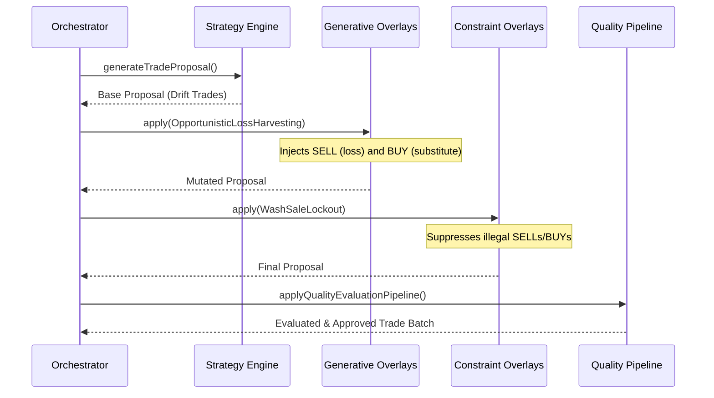

# Execution Overlays & Tax-Loss Harvesting (TLH) PRD

Date: 2026-08-03
Status: DRAFT / REVISION 1

## 1. Background & Context

ADR 0042 established a fundamental separation of concerns: **Allocation Strategies** (what to hold) are decoupled from **Execution Overlays** (how to trade them efficiently). 

As we approach the implementation of Tax-Loss Harvesting (TLH), a critical architectural risk emerges: tax legislation is highly jurisdiction-specific. The US enforces 30-day "Wash Sale" rules, the UK enforces "Bed & Breakfasting" and "Section 104 pools", and other jurisdictions may have no such restrictions. 

To ensure the Rebalancing Engine remains globally applicable, we must distill TLH into a composable, jurisdiction-agnostic architecture.

## 2. Architectural Separation of Concerns

The solution is to introduce the **Execution Overlay Pipeline**, which sits exactly between the mathematical generation of drift-based trades and the final Quality Evaluation Pipeline.

We categorize overlays into two distinct types:
1. **Generative Overlays**: Pure mathematical logic that opportunistically *injects* new trades into the proposal to maximize an objective (e.g., harvesting capital losses). They possess zero knowledge of tax legislation.
2. **Constraint Overlays**: Jurisdictional or structural rules that analyze the proposed trade batch and *suppress* or block trades that violate legislation (e.g., Wash-Sale lockouts).

### Example Pipeline Executions
- **German Client**: Configures `[OpportunisticLossHarvestingOverlay]` (no wash-sale suppression).
- **US Client**: Configures `[OpportunisticLossHarvestingOverlay, UsWashSaleLockoutOverlay]`.
- **UK Client**: Configures `[OpportunisticLossHarvestingOverlay, UkBedAndBreakfastingOverlay]`.

## 3. Interaction Contract & Sequencing (Issue #88)

The Orchestrator evaluates the rebalance using the following strict sequence. Constraints must always evaluate *after* Generative overlays so they can vet both drift trades and tax-motivated trades.



## 4. The `OpportunisticLossHarvestingOverlay` (Generative)

This overlay is responsible exclusively for the math of realizing losses.

### 4.1 Tax-Lot Data Model (Issue #89)
The engine relies on an upstream `TaxLot` dependency (defined in `src/models/domain.ts`). It requires an external broker synchronization service to pre-populate cost basis and acquisition dates before the engine runs. The engine itself will not maintain a ledger of historical cost-basis; it is entirely stateless based on the provided `ValuationResult`.

### 4.2 Loss Identification
It iterates through all tax lots in the portfolio. If a lot's unrealized loss exceeds a configured threshold (`tlhLossThresholdBps`, e.g., 500 for 5%), it flags the lot for harvesting.

### 4.3 Instrument Substitution & Target Equivalency (Issue #87)
If we sell a losing asset (e.g., `IVV`), we cannot simply hold cash; we must reinvest in a highly correlated asset (`VOO`) to maintain market exposure. 
**Target Equivalency (Substitution Groups)** is defined as follows:
- **Scope**: Mandate-level configuration (e.g., specific to the "US Large Cap Tax Aware" model).
- **Persistence**: Stored within the `RebalancingPolicy.equivalencyGroups` array.
- **Application**: The `EvaluationState` temporarily caches this mapping. `calculateDrift` aggregates the weights of all instruments within an Equivalency Group *before* calculating drift against the group's cumulative target. This prevents the Quality Pipeline from rejecting a TLH trade (swapping `IVV` for `VOO`) due to artificial tracking error.
- **Conflict Resolution**: If a substitute later triggers TLH, the bidirectional nature of the groups allows harvesting `VOO` back into `IVV`.

## 5. Jurisdictional Constraints (e.g., `WashSaleLockoutOverlay`)

Constraint overlays analyze the `TradeProposal` after generative overlays have run.

### 5.1 Intra-Proposal Wash Sales (MVP)
For the MVP, the `WashSaleLockoutOverlay` evaluates the current trade batch. If it detects a SELL for a loss on `Asset A`, and a BUY for `Asset A` (perhaps generated independently by the drift strategy), it detects an intra-day wash sale. 
**Precedence Rule**: Constraint overlays must prioritize strategic drift trades over opportunistic tax trades. It will suppress the tax-motivated SELL and allow the drift-motivated BUY.

## 6. Traceability & Explainability (Issue #91)

Overlays mutate the `TradeProposal` and must document *why* via `ProposalWarning` or metadata tags.
- **Format**: `WASH_SALE_LOCKOUT`, `TLH_HARVEST_GENERATED`.
- **Visibility**: These codes are immutably appended to the JSON audit trail.
- **Client Output**: The API layer mapping the audit trail to the advisor UI will translate `WASH_SALE_LOCKOUT` into "Tax-loss harvesting opportunity bypassed due to overlapping buy order (Wash Sale Prevention)".

## 7. Performance & Correctness (Issue #90)

- **Performance Budget**: Overlay execution must strictly adhere to an `O(N * L)` worst-case time complexity, where N is the number of holdings and L is the average number of lots per holding.
- **Implementation Constraints**: Overlays must avoid nested iterations over the full universe and must utilize localized hash maps for equivalency resolution. Overlays must execute synchronously without blocking the event loop on I/O.

## 8. Functional Configuration & Migration (Issue #93)

The `RebalancingPolicy` is extended as follows:
```typescript
export interface RebalancingPolicy {
  // Existing fields...
  executionOverlays?: string[]; // e.g. ['OpportunisticLossHarvesting', 'UsWashSaleLockout']
  tlhLossThresholdBps?: number;
  equivalencyGroups?: string[][]; // e.g. [['IVV', 'VOO'], ['VEA', 'IEFA']]
}
```
**Migration Path**: Existing mandates will have `executionOverlays` undefined by default, ensuring TLH is completely disabled and behavior is 100% backward compatible until explicitly enabled by an admin.

## 9. Acceptance Criteria & Test Matrix (Issue #92)

Testing must prove both happy paths and failure modes across a matrix of configurations:
1. **US Matrix**: `[OpportunisticLossHarvestingOverlay, UsWashSaleLockoutOverlay]` - Proves intra-day wash sale suppression.
2. **UK Matrix**: `[OpportunisticLossHarvestingOverlay, UkBedAndBreakfastingOverlay]` - (Future scope, but pipeline must accommodate it).
3. **Null-Constraint Matrix**: `[OpportunisticLossHarvestingOverlay]` - Proves trades generate without suppression.
4. **Failure Mode (No Substitute)**: A loss threshold is met, but no substitute exists in the equivalency group. (Trade skipped).
5. **Failure Mode (Conflict)**: A drift BUY and TLH SELL occur simultaneously; the constraint overlay suppresses the SELL.
